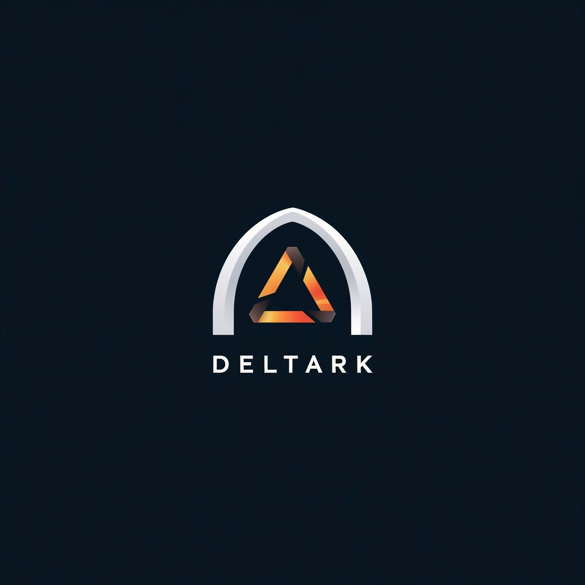

# DeltArk

> [!NOTE]  
> TODO: replace this LLM generated nonsense with a proper project description...

> **Where an arc meets a delta, and fragments form the harmony of tomorrow.**

---

**The Rumor**
Whispers float through code and corridors alike: DeltArk spares you from the never-ending burden of repeated data, tucking each tiny shift into a vault of immovable trust. Some hint it wields an **append-only, random-access** foundation that quietly powers the entire vision. Others describe **content-addressable, recursive block syncing** weaving every file into a cohesive tapestry. Rumors also paint a picture of **multi-tiered saving**—from rapid-fire local edits to grand public unveilings—and **high-performance local sharing**, bound to **effortless cloud relays** that pull the entire world within reach. Meanwhile, **rock-solid skew protection** ensures each viewer’s experience remains intact, no matter how quickly deltas flow. Yet, even now, the full truth remains veiled in the place where arcs and deltas collide.

---

**The Core Whispers**
- _Append-Only, Random-Access_ — a steady undercurrent that never betrays its history.
- _Content-Addressable Blocks_ — cryptographically precise, deduplicating every piece.
- _Multi-Tiered Saving_ — from spontaneous local saves to carefully curated releases.
- _High-Performance Local Sharing_ — as instant as passing a note under a door.
- _Cloud Relays & Caches_ — bridging every distance with minimal effort.
- _Effortless Publishing_ — step back and let DeltArk do the heavy lifting.
- _Rock-Solid Skew Protection_ — every moment’s version served exactly as intended.

---

**Beyond the Horizon**
A kaleidoscope of chunk references or a tapestry woven from minimal diffs — DeltArk stands ready at the threshold, waiting for a single save to become a timeless ledger entry. What lies ahead? Only the arc knows, gathering deltas that spark entire worlds into being.

---

**Stay Tuned**
Look for the arc, chase the delta, and watch as the simplest act of creation births a symphony of possibility.
